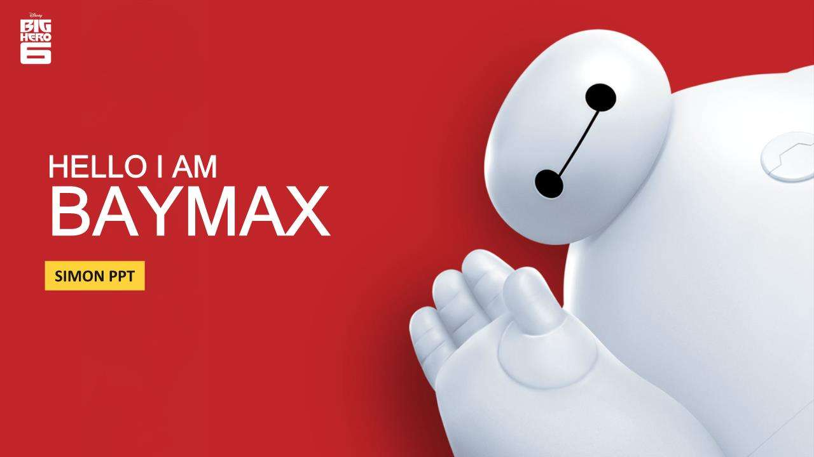

# My Theme
> 精于心，简于形 
 
## 我的Jekyll主题

* `kpper_next` | <a href="https://kpper.github.io/kpper_next/ " target="_blank">在线预览 Preview</a> | [仓库源码欢迎star](https://github.com/kpper/kpper_next)
* `kpper_simple` | <a href="https://kpper.github.io/kpper_simple/ " target="_blank">在线预览 Preview</a> | [仓库源码欢迎star](https://kpper.github.io/kpper_simple/)
* `kpper_clean` | <a href="https://kpper.github.io/kpper_clean/ " target="_blank">在线预览 Preview</a> | [仓库源码欢迎star](https://github.com/kpper/kpper_clean)
* `kpper_jacman` | <a href="https://kpper.github.io/kpper_jacman/ " target="_blank">在线预览 Preview</a> | [仓库源码欢迎star](https://github.com/kpper/kpper_jacman)

## 我的Hexo主题
>仅仅是fork过来以后有时间折腾
* `hexo-theme-next` | <a href="https://kpper.github.io/hexo-theme-next/ " target="_blank">在线预览 Preview</a> | [仓库源码欢迎star](https://github.com/kpper/hexo-theme-next)
* `kpper_next` 是由 [Hexo NexT](https://github.com/iissnan/hexo-theme-next) 移植而来的 Jekyll 主题。现在原作者已经不维护了，最新版由社区维护[社区维护版本](https://github.com/theme-next/hexo-theme-next)

## 支持
>你可以选择一款适合自己的，当然我只是一个搬运工，只是加入了自己想要的功能。目前在用第一款主题，以后会加入其他功能，其他主题可能以后有时间会折腾吧，暂时就这样了。
* 你可以自由的fork这些主题,每个主题都有帮助文档，对着改就行了。或者可以直接下载zip到本地自己去修改。
* 你也可以直接去fork原作者的blog。
* 如果你喜欢我的这个博客模板，请在Repository里点个赞——右上角**star**一下。

## 浏览器支持 Browser support

## 贡献 Contributing

欢迎提交问题与需求，修复代码。

## 开发 Development

主旨在于简洁优雅且易于使用，所以首先要尽量确保主题的简洁易用性。

First things first, always keep things simple.

## 特别致谢

1. `kpper_next`基于[Simpleyyt](https://github.com/Simpleyyt/jekyll-theme-next)  修改的，感谢这个作者。
2. `kpper_simple`基于[Gaohaoyang](https://github.com/Gaohaoyang/gaohaoyang.github.io)  修改的，感谢这个作者。
3. `kpper_clean`基于[FeDemo](https://github.com/FeDemo/fedemo.github.io)  修改的，感谢这个作者。
4. `kpper_jacman`基于[Simpleyyt](https://github.com/simpleyyt/jekyll-jacman)  修改的，感谢这个作者。
5. 感谢 Jekyll、Github Pages 和 Bootstrap!

## 捐赠

支付宝捐赠链接还是要有的，万一真的有人捐呢。

## 最后
回顾博客的诞生，纯粹是出于个人兴趣。如果你恰好逛到了这里，希望你也能喜欢我的博客主题。
